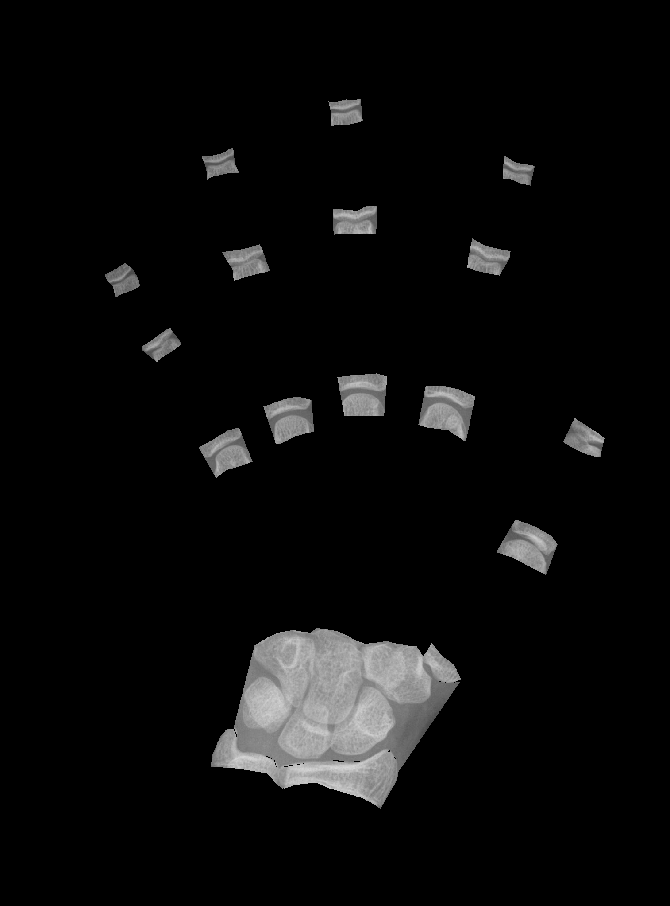
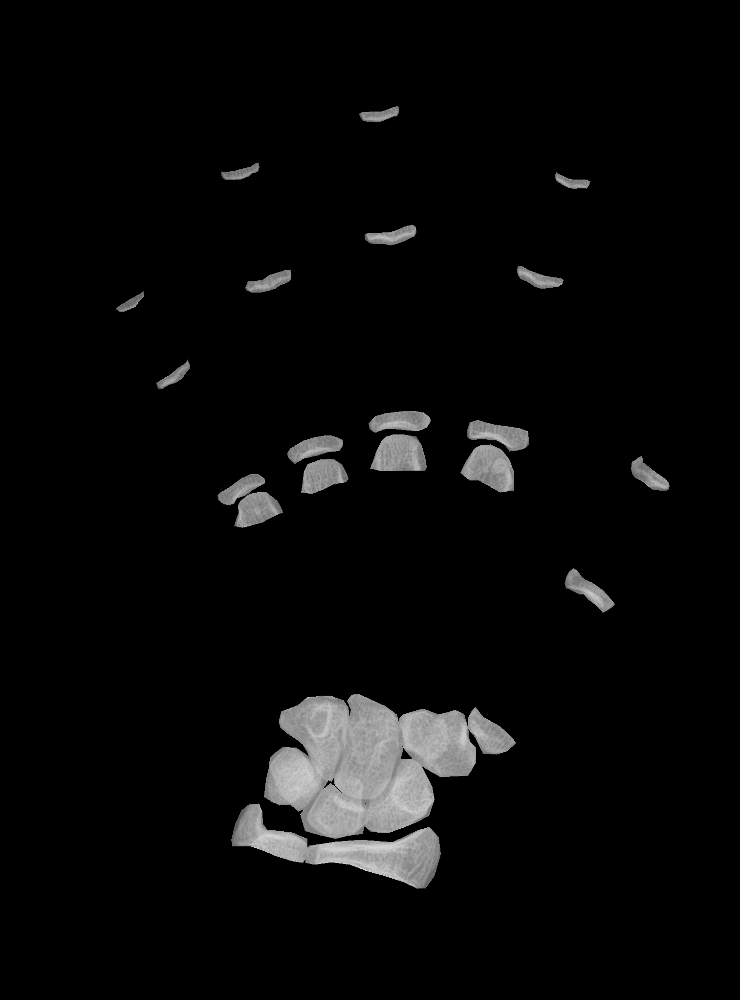
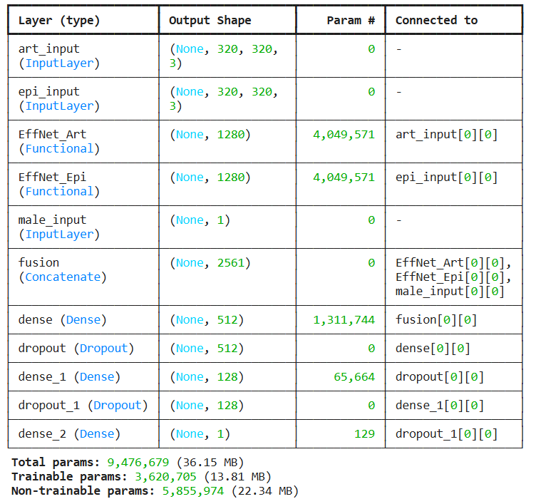
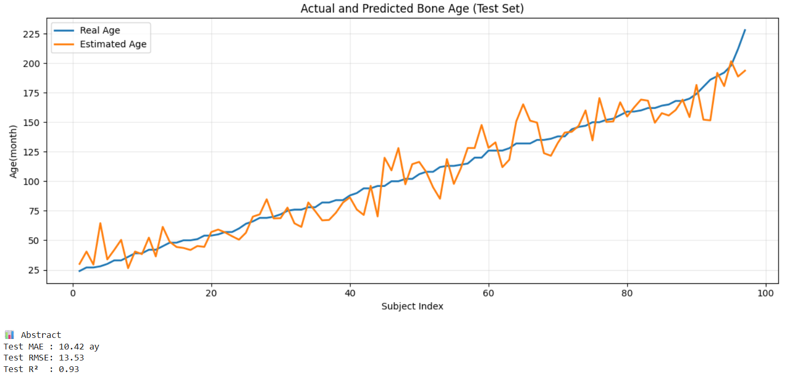

## Introduction

Bone age assessment is an important tool for evaluating growth and development in pediatric patients. It is commonly performed by analyzing hand and wrist X-ray images, but traditional methods rely heavily on expert interpretation and can be time-consuming.

This project aims to develop a deep learning–based system that automatically estimates bone age from hand X-ray images. The goal is to create a fast, consistent, and reliable approach that can support clinical evaluation and reduce the dependence on manual assessment.

## Dataset
The dataset used in this project consists of **hand X-ray images** for bone age estimation. 
For each individual, two anatomical regions are extracted from the original images: the **articular surface** and the **epiphysis**, allowing the model to focus on the most relevant bone structures while reducing background effects.

Each sample includes the **bone age label** (in months) and **gender information** (male/female) as an additional feature.  
To evaluate the model's generalization capability, the dataset is divided into **training**, **validation**, and **test** sets.  
Separate image directories and label files are used for each subset to prevent data leakage during the training process.

### Example Regions

&nbsp;&nbsp;&nbsp;&nbsp;&nbsp;&nbsp;&nbsp;&nbsp;&nbsp;&nbsp;&nbsp;&nbsp;&nbsp;&nbsp;&nbsp;&nbsp;&nbsp;&nbsp;&nbsp;&nbsp;&nbsp;&nbsp;&nbsp;&nbsp;&nbsp;&nbsp;
<b>Articular Surface</b> &nbsp;&nbsp;&nbsp;&nbsp;&nbsp;&nbsp;&nbsp;&nbsp;&nbsp;&nbsp;&nbsp;&nbsp;&nbsp;&nbsp;&nbsp;&nbsp;&nbsp;&nbsp;&nbsp;&nbsp;&nbsp;&nbsp;&nbsp;&nbsp;&nbsp;&nbsp;&nbsp;&nbsp;&nbsp;&nbsp;&nbsp;&nbsp;&nbsp;&nbsp;&nbsp;&nbsp;&nbsp;&nbsp;&nbsp;&nbsp;&nbsp;&nbsp;&nbsp;&nbsp;&nbsp;&nbsp;&nbsp;&nbsp;&nbsp;&nbsp;&nbsp;&nbsp;&nbsp;&nbsp;
<b>Epiphysis</b>

&nbsp;&nbsp;&nbsp;&nbsp;&nbsp;&nbsp;&nbsp;

&nbsp;&nbsp;&nbsp;&nbsp;&nbsp;&nbsp;&nbsp;&nbsp;&nbsp;&nbsp;&nbsp;&nbsp;&nbsp;

## Method
DenseNet121, ResNet50, EfficientNetB3, and EfficientNetB0 models were evaluated, and EfficientNetB0, which showed the best performance, was selected. The model employs a dual-branch CNN architecture that processes articular surface and epiphysis images separately. Before being fed into the model, the images were resized to 320×320 pixels and passed through preprocessing steps.

In both branches, networks pretrained on ImageNet were used and a transfer learning approach was applied, where most layers were frozen and only the final layers were fine-tuned during training. The extracted image features were fused with gender information and passed to fully connected layers. The model output consists of a single neuron that predicts the normalized bone age. During training, Mean Absolute Error (MAE) was used as the loss function, and early stopping and learning rate reduction were applied to reduce the risk of overfitting.

&nbsp;&nbsp;&nbsp;&nbsp;&nbsp;&nbsp;&nbsp;&nbsp;

## Performance Analysis
The performance of the proposed deep learning model was evaluated on the test set using **Mean Absolute Error (MAE)**, **Root Mean Square Error (RMSE)**, and **R²** metrics. The model achieved an MAE of approximately **10.42 months** on the test set. Considering that bone age estimation is a challenging regression problem with high variability, this result indicates a realistic and acceptable level of performance.

&nbsp;&nbsp;&nbsp;&nbsp;&nbsp;&nbsp;&nbsp;&nbsp;

